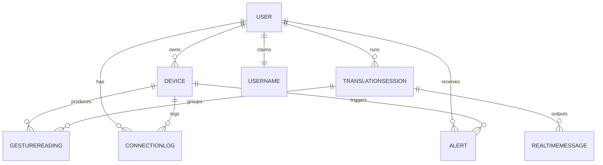

# Database & Backend Design

### Intelligent Glove for Arabic Sign Language — Firebase Backend

This document is the technical reference for the project's backend. It is
written to double as a **university-project report section**: it explains the
data model, the relationships between entities, example documents, the
security model, the Flutter service layer, and how every piece supports the
smart-glove application.

---

## 1. Overview — how the backend supports the app

A deaf or mute user wears a **smart glove**. The glove's flex / motion sensors
stream data over Bluetooth to the Flutter app. The app classifies each hand
shape into an **Arabic Sign Language** gesture and, grouped into a
**translation session**, turns those gestures into readable Arabic text shown
as a live message feed. The phone is also responsible for monitoring the
glove's **connection** and **battery**, and raising **alerts** the user can
act on.

Firebase is the backend for all of this:

| App need | Firebase service | Where in this repo |
|----------|------------------|--------------------|
| Accounts, Google login, password reset | **Authentication** | `services/auth_service.dart` |
| All persistent data (8 collections) | **Cloud Firestore** | `services/*` + `models/*` |
| Profile photos | **Cloud Storage** | `services/storage_service.dart` |
| Push notifications for alerts | **Cloud Messaging** | `services/messaging_service.dart`, `functions/` |
| Username validation, server alerts | **Cloud Functions** (optional) | `functions/index.js` |

The data is deliberately **analytics-friendly** (flat top-level collections,
denormalised counters, server timestamps) so the Analytics tab can compute
sessions-per-user, average duration, most-used glove, gesture accuracy,
battery problems, and connection-loss frequency without expensive scans.

---

## 2. Entity-Relationship model

```
              ┌──────────────┐
              │    User      │  users/{uid}
              │  (1 account) │
              └──────┬───────┘
                     │ 1
        ┌────────────┼───────────────────────────────┐
        │ many       │ many                           │ many
        ▼            ▼                                 ▼
┌──────────────┐  ┌────────────────────┐     ┌──────────────────┐
│   Device     │  │ TranslationSession │     │      Alert       │
│ devices/{id} │  │ translationSessions│     │   alerts/{id}    │
└──────┬───────┘  └─────────┬──────────┘     └──────────────────┘
       │ 1                  │ 1
       │ many               │ many
       ▼                    ▼
┌──────────────┐   ┌──────────────────┐
│GestureReading│──▶│ RealtimeMessage  │
│gestureReadings│  │ realtimeMessages │
└──────────────┘   └──────────────────┘
       ▲
       │ many              ┌──────────────────┐
       └──── Device also ─▶│  ConnectionLog   │
             produces      │  connectionLogs  │
                           └──────────────────┘
```

The required relationship chain, stated plainly:

> **User** `1‑to‑many` **Devices** → each **Device** produces **GestureReadings**
> → GestureReadings **feed** a **TranslationSession** → the TranslationSession
> **outputs** **RealtimeMessages**. Devices also emit **ConnectionLogs** and
> (with the user) **Alerts**.



**Why top-level collections instead of subcollections?**
Every business collection stores an owner field (`userId` / `ownerId`). This
keeps documents shallow, lets a single security predicate protect them, and
makes cross-entity analytics (e.g. "all sessions for this device") trivial.

---

## 3. Collections & fields

### 3.1 `users/{uid}` — personal profile

| Field | Type | Notes |
|-------|------|-------|
| `uid` | string | = Auth uid, also the document id. **Immutable.** |
| `fullName` | string | Display name. |
| `email` | string | Login email. |
| `uniqueUsername` | string | Lower-cased; unique (see `usernames`). |
| `phoneNumber` | string? | Optional. |
| `photoUrl` | string? | Cloud Storage download URL. |
| `createdAt` | timestamp | Server-set. **Immutable.** |
| `lastLoginAt` | timestamp | Updated each login. |
| `authProvider` | string | `email/password` \| `google`. |
| `role` | string | `user` \| `admin`. **Client cannot change.** |
| `totalDevices` | int | Denormalised counter. |
| `totalSessions` | int | Denormalised counter. |
| `lastConnectedDevice` | string? | deviceId of last connected glove. |
| `accountStatus` | string | `active` \| `suspended` \| `disabled`. |

### 3.2 `usernames/{username}` — uniqueness index

| Field | Type | Notes |
|-------|------|-------|
| *(doc id)* | string | The lower-cased username. |
| `uid` | string | Owner. |
| `createdAt` | timestamp | When claimed. |

A single-document `get` on this collection answers "is this username free?"
in O(1). Reserved atomically with the profile inside a transaction.

### 3.3 `devices/{deviceId}` — the smart glove

| Field | Type | Notes |
|-------|------|-------|
| `deviceId` | string | Doc id (hardware/BLE id if available). |
| `ownerId` | string | = uid. **Immutable.** |
| `deviceName` | string | User-editable ("rename glove"). |
| `deviceType` | string | Always `smart_glove`. |
| `gloveModel` | string | e.g. `IG-Pro-v2`. |
| `firmwareVersion` | string | e.g. `1.4.0`. |
| `isConnected` | bool | Live link flag. |
| `connectionStatus` | string | `connected` \| `disconnected` \| `lost`. |
| `batteryLevel` | int | 0–100. |
| `batteryStatus` | string | `normal` (>20) \| `low` (≤20) \| `critical` (≤5). |
| `lastConnectedAt` | timestamp? | |
| `lastDisconnectedAt` | timestamp? | |
| `createdAt` / `updatedAt` | timestamp | |

### 3.4 `connectionLogs/{logId}` — connection history (append-only)

| Field | Type | Notes |
|-------|------|-------|
| `logId` `userId` `deviceId` `deviceName` | string | |
| `eventType` | string | `connected` \| `disconnected` \| `connection_lost` \| `connection_restored`. |
| `timestamp` | timestamp | Server-set. |
| `batteryLevel` | int | Battery at the moment of the event. |
| `sessionId` | string? | Linked session, if any. |

### 3.5 `gestureReadings/{readingId}` — recognised gestures (append-only)

| Field | Type | Notes |
|-------|------|-------|
| `readingId` `userId` `deviceId` `sessionId` | string | `sessionId` links to its session. |
| `rawSensorData` | map | Flex / IMU values from the glove. |
| `detectedGesture` | string | The recognised letter/word. |
| `confidenceScore` | double | 0.0–1.0. |
| `language` | string | `Arabic Sign Language`. |
| `timestamp` | timestamp | Server-set. |

### 3.6 `translationSessions/{sessionId}` — a translation run

| Field | Type | Notes |
|-------|------|-------|
| `sessionId` `userId` `deviceId` `deviceName` | string | |
| `startedAt` / `endedAt` | timestamp | |
| `sessionDuration` | int | Seconds — precomputed for analytics. |
| `status` | string | `active` \| `completed` \| `interrupted`. |
| `translatedText` | string | Full transcript. |
| `totalGestures` | int | Aggregated on end. |
| `averageConfidence` | double | Aggregated on end. |
| `createdAt` | timestamp | |

### 3.7 `realtimeMessages/{messageId}` — live translated feed

| Field | Type | Notes |
|-------|------|-------|
| `messageId` `userId` `deviceId` `sessionId` | string | |
| `translatedText` | string | The message text. |
| `language` | string | `Arabic`. |
| `createdAt` | timestamp | Ordering key for the chat feed. |
| `messageType` | string | `translation` \| `alert` \| `system`. |

### 3.8 `alerts/{alertId}` — notifications

| Field | Type | Notes |
|-------|------|-------|
| `alertId` `userId` `deviceId` | string | |
| `alertType` | string | `battery_low` \| `battery_critical` \| `connection_lost` \| `connection_restored` \| `device_connected` \| `device_disconnected` \| `emergency_sos`. |
| `title` `message` | string | Display text. |
| `severity` | string | `low` \| `medium` \| `high` \| `critical`. |
| `isRead` | bool | Only field the client may flip. |
| `createdAt` | timestamp | |

---

## 4. Example documents (JSON)

```jsonc
// users/2bQ7…uid
{
  "uid": "2bQ7xKwz9aRn",
  "fullName": "Sara Ali",
  "email": "sara@example.com",
  "uniqueUsername": "sara_ali",
  "phoneNumber": null,
  "photoUrl": "https://firebasestorage.../avatar.jpg",
  "createdAt": "2026-06-05T10:00:00Z",
  "lastLoginAt": "2026-06-05T18:32:00Z",
  "authProvider": "email/password",
  "role": "user",
  "totalDevices": 1,
  "totalSessions": 12,
  "lastConnectedDevice": "glove_IG_8841",
  "accountStatus": "active"
}
```

```jsonc
// usernames/sara_ali
{ "uid": "2bQ7xKwz9aRn", "createdAt": "2026-06-05T10:00:00Z" }
```

```jsonc
// devices/glove_IG_8841
{
  "deviceId": "glove_IG_8841",
  "ownerId": "2bQ7xKwz9aRn",
  "deviceName": "Sara's Right Glove",
  "deviceType": "smart_glove",
  "gloveModel": "IG-Pro-v2",
  "firmwareVersion": "1.4.0",
  "isConnected": true,
  "connectionStatus": "connected",
  "batteryLevel": 78,
  "batteryStatus": "normal",
  "lastConnectedAt": "2026-06-05T18:30:00Z",
  "lastDisconnectedAt": "2026-06-05T12:05:00Z",
  "createdAt": "2026-05-20T09:00:00Z",
  "updatedAt": "2026-06-05T18:30:00Z"
}
```

```jsonc
// gestureReadings/r_001
{
  "readingId": "r_001",
  "userId": "2bQ7xKwz9aRn",
  "deviceId": "glove_IG_8841",
  "sessionId": "s_55",
  "rawSensorData": { "flex": [820, 410, 230, 190, 600],
                     "accel": { "x": 0.1, "y": 0.9, "z": 0.2 } },
  "detectedGesture": "سلام",
  "confidenceScore": 0.94,
  "language": "Arabic Sign Language",
  "timestamp": "2026-06-05T18:31:02Z"
}
```

```jsonc
// translationSessions/s_55
{
  "sessionId": "s_55", "userId": "2bQ7xKwz9aRn",
  "deviceId": "glove_IG_8841", "deviceName": "Sara's Right Glove",
  "startedAt": "2026-06-05T18:31:00Z", "endedAt": "2026-06-05T18:34:24Z",
  "sessionDuration": 204, "status": "completed",
  "translatedText": "سلام كيف حالك",
  "totalGestures": 18, "averageConfidence": 0.91,
  "createdAt": "2026-06-05T18:31:00Z"
}
```

```jsonc
// realtimeMessages/m_900
{
  "messageId": "m_900", "userId": "2bQ7xKwz9aRn",
  "deviceId": "glove_IG_8841", "sessionId": "s_55",
  "translatedText": "سلام", "language": "Arabic",
  "createdAt": "2026-06-05T18:31:02Z", "messageType": "translation"
}
```

```jsonc
// connectionLogs/l_77
{
  "logId": "l_77", "userId": "2bQ7xKwz9aRn",
  "deviceId": "glove_IG_8841", "deviceName": "Sara's Right Glove",
  "eventType": "connection_lost", "timestamp": "2026-06-05T18:33:10Z",
  "batteryLevel": 76, "sessionId": "s_55"
}
```

```jsonc
// alerts/a_120
{
  "alertId": "a_120", "userId": "2bQ7xKwz9aRn", "deviceId": "glove_IG_8841",
  "alertType": "battery_low", "title": "Battery low",
  "message": "Sara's Right Glove battery is at 18%.",
  "severity": "medium", "isRead": false, "createdAt": "2026-06-05T18:40:00Z"
}
```

---

## 5. Security model (`firestore.rules`)

The rules enforce one rule above all: **a signed-in user can only touch their
own data.**

| Collection | read | create | update | delete |
|-----------|------|--------|--------|--------|
| `users` | owner | self, `role` forced to `user` | owner, **`uid`/`createdAt`/`role`/`authProvider` locked** | owner |
| `usernames` | public `get` (availability) | owner, only if free | ✗ | owner |
| `devices` | owner | owner | owner, **`ownerId`/`deviceId`/`createdAt` locked** | owner |
| `connectionLogs` | owner | owner | ✗ (append-only) | ✗ |
| `gestureReadings` | owner | owner | ✗ (append-only) | ✗ |
| `translationSessions` | owner | owner | owner, ids/`createdAt` locked | owner |
| `realtimeMessages` | owner | owner | ✗ | owner |
| `alerts` | owner | owner | owner, **only `isRead` changeable** | owner |

Key techniques used:

* `ownsResource('userId')` / `ownsIncoming('ownerId')` — match the owner
  field against `request.auth.uid` for existing vs incoming data.
* `unchanged('field')` — blocks edits to protected/identity fields.
* `onlyChanges(['isRead'])` — `diff().affectedKeys().hasOnly(...)` so an alert
  update can flip `isRead` and nothing else.
* **Cloud Functions use the Admin SDK and bypass these rules**, so
  server-side alert generation and analytics aggregation still work.

---

## 6. Flutter service-class structure

```
lib/backend/
├── backend.dart                 ← barrel: import everything in one line
├── glove_backend.dart           ← FACADE: high-level flows the UI calls
├── core/
│   ├── enums.dart               ← typed status/type enums + wire mapping
│   ├── firebase_refs.dart       ← collection names + typed references
│   └── firestore_utils.dart     ← safe Timestamp/num/bool parsing
├── models/                      ← one immutable class per collection
│   ├── app_user.dart            ├── glove_device.dart
│   ├── connection_log.dart      ├── gesture_reading.dart
│   ├── translation_session.dart ├── realtime_message.dart
│   └── glove_alert.dart
└── services/                    ← one service per domain (single responsibility)
    ├── auth_service.dart        ├── username_service.dart
    ├── user_service.dart        ├── device_service.dart
    ├── connection_log_service.dart  ├── gesture_service.dart
    ├── session_service.dart     ├── message_service.dart
    ├── alert_service.dart       ├── analytics_service.dart
    ├── storage_service.dart     └── messaging_service.dart
```

**Layering:** UI → `GloveBackend` (facade) → domain services → `FirebaseRefs`
→ Firestore. Models translate documents ↔ Dart objects. Each service owns
exactly one collection; the facade composes them into real flows.

### Flow → method map (deliverables)

| Flow | Call |
|------|------|
| Sign up (email) | `backend.registerWithEmail(...)` |
| Login (email) | `backend.signInWithEmail(...)` |
| Google login | `backend.signInWithGoogle()` |
| Forgot password | `backend.sendPasswordReset(email)` |
| Username available? | `backend.isUsernameAvailable(name)` |
| Add glove | `backend.addGlove(...)` |
| Rename glove | `backend.renameGlove(id, name)` |
| Update connection (+log +alert) | `backend.setConnectionStatus(id, status)` |
| Report battery (+alert) | `backend.reportBattery(id, level)` |
| Start session | `backend.startTranslation(...)` |
| Record gesture (+message) | `backend.recordGesture(...)` |
| End session (+aggregate) | `backend.endTranslation(id)` |
| Create realtime message | `backend.messages.createMessage(...)` |
| Create alert | `backend.alerts.create(...)` (or typed helpers) |
| Emergency SOS | `backend.triggerSos(...)` |
| Session history | `backend.sessionHistory()` |

---

## 7. Analytics — every required metric

All implemented in `services/analytics_service.dart`:

| Requirement | Method |
|-------------|--------|
| Sessions per user | `sessionCount(uid)` (server `.count()`) |
| Average session duration | `averageSessionDuration(uid)` |
| Most used glove/device | `mostUsedDeviceId(uid)` / `sessionsPerDevice(uid)` |
| Total gestures detected | `totalGesturesDetected(uid)` |
| Gesture accuracy/confidence | `averageConfidence(uid)` |
| Battery problems per device | `batteryProblemsPerDevice(uid)` |
| Connection-loss frequency | `connectionLossCount(uid)` |
| Daily/weekly/monthly usage | `sessionsPerDay(uid, days: …)` |
| Dashboard summary (parallel) | `overview(uid)` → `UserAnalytics` |

Because `sessionDuration`, `totalGestures`, and `averageConfidence` are
**precomputed and stored on each session at end-time**, these analytics read a
small number of session documents instead of scanning thousands of gestures.

---

## 8. End-to-end example (the data chain in action)

```dart
final backend = GloveBackend();

// 1. User signs in
await backend.signInWithEmail(email: 'sara@example.com', password: '••••••');

// 2. Glove connects → device updated + connectionLog + "device connected" alert
await backend.setConnectionStatus('glove_IG_8841', ConnectionStatus.connected);

// 3. Start a translation session
final session = await backend.startTranslation(
  deviceId: 'glove_IG_8841', deviceName: "Sara's Right Glove",
);

// 4. Each recognised gesture → gestureReading + realtimeMessage (live feed)
await backend.recordGesture(
  sessionId: session.sessionId, deviceId: 'glove_IG_8841',
  rawSensorData: {'flex': [820, 410, 230, 190, 600]},
  detectedGesture: 'سلام', confidenceScore: 0.94,
);

// 5. Battery drops to 4% → critical alert (push via Cloud Function)
await backend.reportBattery('glove_IG_8841', 4);

// 6. End session → duration + totalGestures + averageConfidence computed
final done = await backend.endTranslation(session.sessionId);
print('Translated: ${done.translatedText} in ${done.durationLabel}');
```

This single chain exercises **User → Device → GestureReading →
TranslationSession → RealtimeMessage**, plus ConnectionLog and Alert — the
complete required relationship graph.
